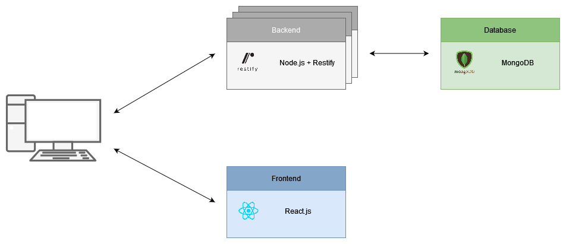

# Things2Do

> Distributed todo application for recording tasks to be completed.

## Table of Contents

- [Introduction](#introduction)
- [License](#license)
  - [Forbidden](#forbidden)

## Introduction

The Things2Do project is being developed as part of a practical course in Business Informatics at
[DHBW Karlsruhe](https://www.karlsruhe.dhbw.de/startseite.html). The goal is the development of
a distributed software system with the domain of a simple todo list. This includes both frontend and
backend, connected via a RESTful interface.



## Deployment

The deployment can be done cloud-native via Kubernetes cluster or via Docker Compose.

### Docker Compose

When deploying via Docker Compose, the architecture is deployed on a single machine in the form of
containers. For this purpose, the individual container images are first built and then put into
production. The following command is sufficient to build the architecture-relevant images:

```bash
$ docker-compose -f ./docker/docker-compose.yml build
```

Once the individual images have been built, the containers can be started. Among other things,
the database must be configured via the connection URI string. The following command allows the
architecture to start:

```bash
$ docker-compose -f ./docker/docker-compose.yml up -d
```

The preceding command sets up the entire architecture including the required database and gateway.
The frontend or backend can be reached via the gateway via the standard HTTP port 80.

### Kubernetes

Kubernetes enables deployment across multiple machines. Containers are also created for this which are
based on images. These must first be built manually for the frontend or backend.

```bash
$ docker build -t things2do/backend:latest ./backend
$ docker build -t things2do/frontend:latest --build-arg THINGS2DO_API=<TWADDLE API URI> ./frontend
```

When building the frontend image, it is important to note that the URI of the backend must be given as
a build argument at the time of construction. This URI will later be hardcoded in the frontend build.
In doing so, `<TWADDLE API URI>` is to be replaced by the respective URI of the backend. In addition,
the images must be stored in the Kubernetes local image registry, otherwise Kubernetes will not find
the images when instantiating.

Once the images are built, the architecture can be deployed in the Kubernetes cluster.

```bash
$ kubectl apply -f ./k8s
$ kubectl apply -f ./backend/k8s
$ kubectl apply -f ./frontend/k8s
```

This also sets up the entire architecture, accessible via the standard HTTP port 80, including the database.

## License

Copyright (c) 2022 Constantin Müller, Christian Müller, Kemal Celik

Permission is hereby granted, free of charge, to any person obtaining a copy
of this software and associated documentation files (the "Software"), to deal
in the Software without restriction, including without limitation the rights
to use, copy, modify, merge, publish, distribute, sublicense, and/or sell
copies of the Software, and to permit persons to whom the Software is
furnished to do so, subject to the following conditions:

The above copyright notice and this permission notice shall be included in all
copies or substantial portions of the Software.

THE SOFTWARE IS PROVIDED "AS IS", WITHOUT WARRANTY OF ANY KIND, EXPRESS OR
IMPLIED, INCLUDING BUT NOT LIMITED TO THE WARRANTIES OF MERCHANTABILITY,
FITNESS FOR A PARTICULAR PURPOSE AND NONINFRINGEMENT. IN NO EVENT SHALL THE
AUTHORS OR COPYRIGHT HOLDERS BE LIABLE FOR ANY CLAIM, DAMAGES OR OTHER
LIABILITY, WHETHER IN AN ACTION OF CONTRACT, TORT OR OTHERWISE, ARISING FROM,
OUT OF OR IN CONNECTION WITH THE SOFTWARE OR THE USE OR OTHER DEALINGS IN THE
SOFTWARE.

[MIT License](https://opensource.org/licenses/MIT) or [LICENSE](LICENSE) for
more details.

### Forbidden

**Hold Liable**: Software is provided without warranty and the software
author/license owner cannot be held liable for damages.
